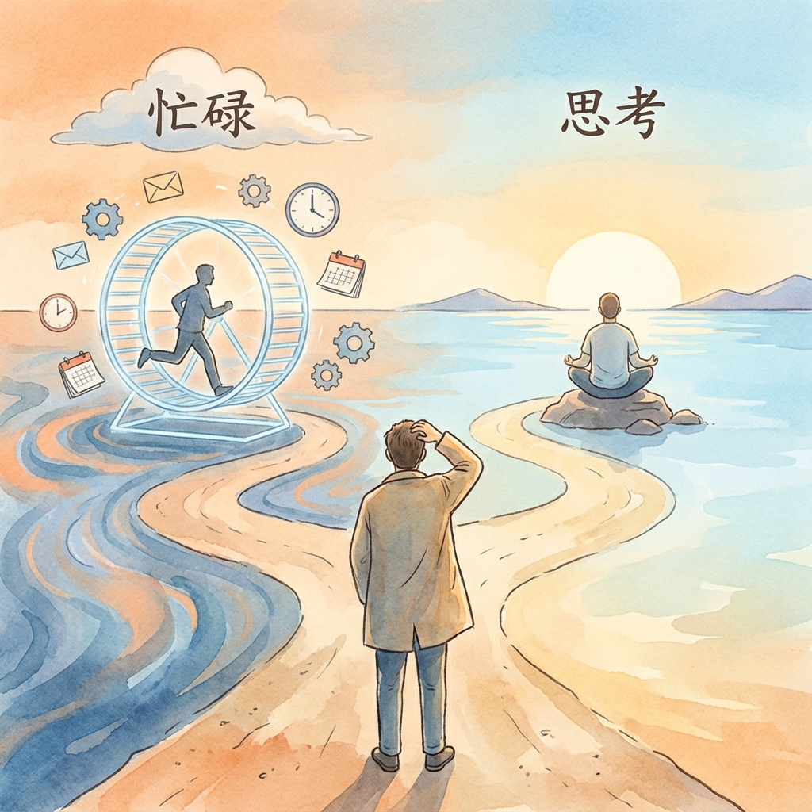
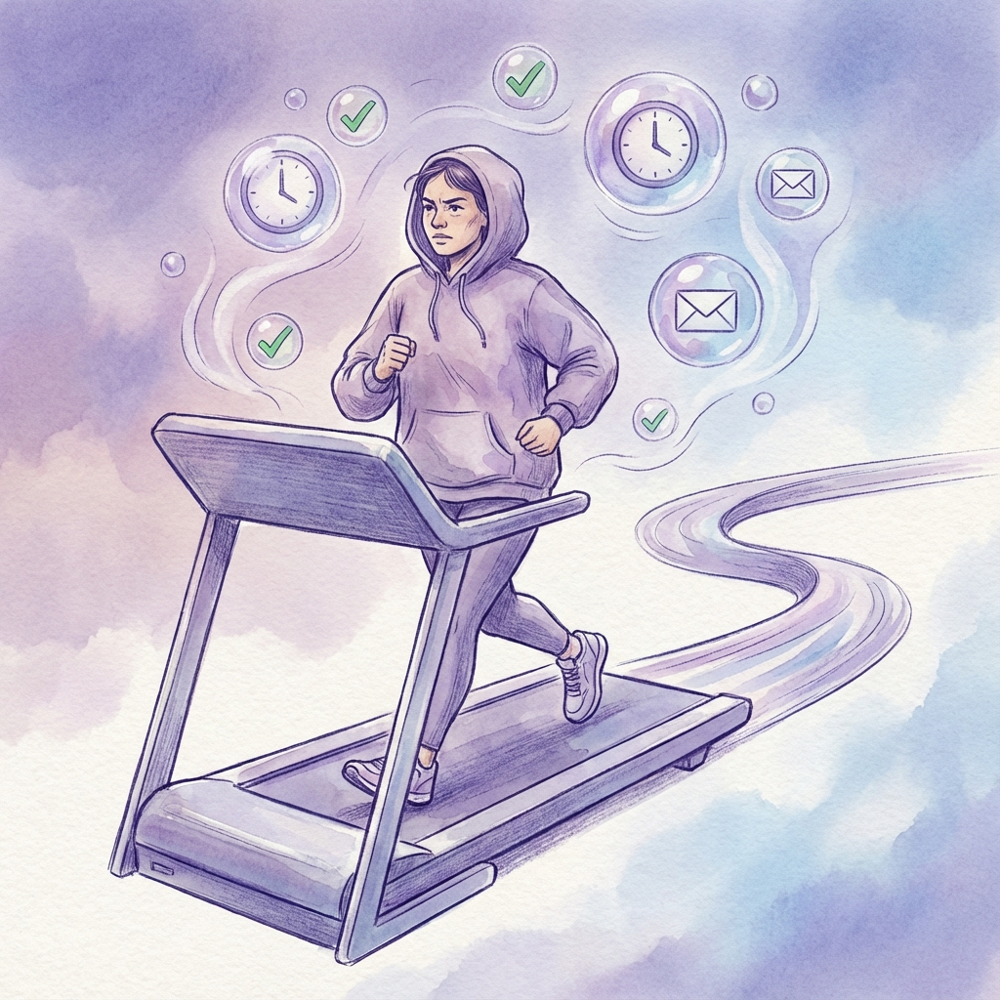
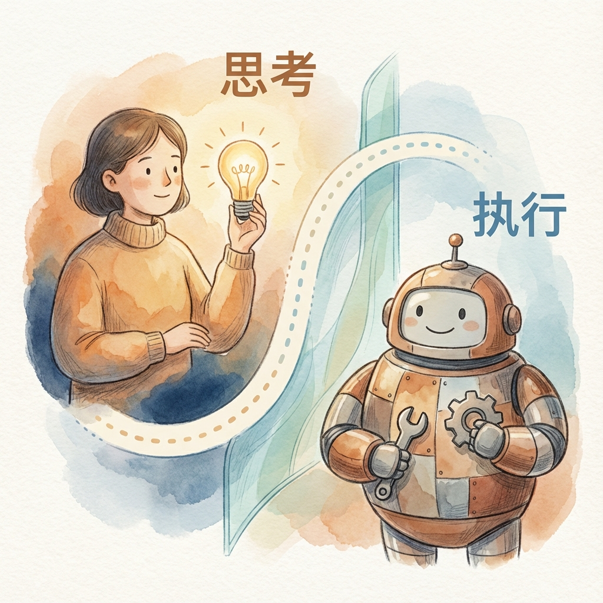
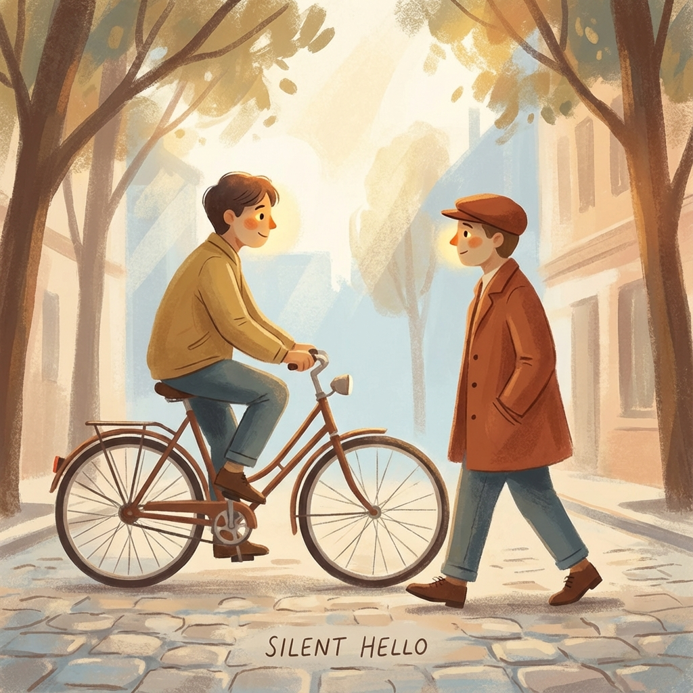

上一篇文章提到了，人定目标、AI执行、最后人筛选。听起来很合理？人负责想要什么，AI负责干活，最后人来挑选最好的结果。

我一开始也这么想。但后来发现，效率是提升了不少，但该做的事情没有变。

那天的述职会，我准备了一个小时的PPT。轮到我汇报的时候，领导的眼睛一直盯着自己的电脑，偶尔抬头，在我某个停顿的间隙插上一句话。那一刻我突然想：如果用AI来写这份述职报告，我能省下一个半小时。

但省下的这一个半小时，会用来做什么？

答案是：做更多类似的事情。

---

AI写周报、AI做PPT、AI分析数据，每一个工具都在告诉我"我能帮你省时间"。时间确实省下来了，但当你回顾这一天做的事情时，会发现它并没有变空，反而塞进了更多任务。

就像你在跑步机上跑步，你跑得越快，皮带转得也越快，你必须跑得更快才能保持不掉下去。

我开始问自己：问题出在哪？

我发现，AI帮我加速的，只是"**怎么做**"这件事。但"**为什么要做**"这个问题，却从来没碰过。

周报还是要写，述职会还是要开，分析报告还是要交。游戏规则本身没变。

这就像当年电力刚发明的时候，很多工厂只是用电灯替代了煤油灯，生产线的布局一点没变。真正的改变发生在几十年后，人们意识到有了电力，整个工厂的布局可以重新设计。

AI也是一样。它真正的价值，不是帮你把旧流程跑得更快，而是让你有余力停下来问一句：这个流程，还需要存在吗？

---

回到那个让我顿悟的述职会。

我后来试着问自己：为什么我要花2小时做PPT？

"为了向领导汇报进度。"

那为什么汇报进度需要这么精美的PPT？

"因为如果不精美，显得我不重视。"

领导真正需要的是精美，还是信息的确定性？

"其实他只关心项目有没有出风险。"

那为什么不直接发一个"风险仪表盘"给他，而要开会？

"因为我们之间没有建立'实时同步'的机制，他需要通过'看我汇报'这个仪式来建立安全感。"

问到这里，会发现：真正限制我的，不是"做PPT的效率"，而是"信任机制的缺失"。

用AI帮我做PPT，只是让我更低成本地生产信息，但这些信息反而会淹没领导的注意力，加剧信任危机。

如果我真的想解决问题，不是"用AI 30秒生成PPT"，而是建立一个透明的进度看板，让周报和述职逐渐消失。

你看，这是两条完全不同的路：
- 一条是加速**旧流程**——用AI写周报，但周报还在
- 一条是**质疑流程**本身——让周报这个东西消失，信息流动更顺畅

前者是在旧游戏里跑得更快，后者是改变游戏规则。

---

说到这里，你可能会问：那我该怎么办？

说实话，我也不知道完美答案。但我在尝试一个方法。

首先找到做事的流程是什么？

然后中间的关键约束是什么？
- 谁有权说"不"? 谁能跳过流程？
- 什么行为被奖励? 什么被惩罚?
- 谁掌握关键信息? 信息如何传递?

最后思考解除它的需要什么条件？

---

AI是这个时代最强大的能力放大器。但放大器只能放大你原本要走的方向——如果方向本身就是错的，你只会更快地走进死胡同。

也许可以试试，下周找一件你习惯性自己做的事，交给AI做70%，然后观察自己感到"不舒服"的地方。

如果在"观点"上不舒服，说明AI正在稀释你的灵魂，把权力拿回来。

我也在尝试，一起看看会发生什么。

---

最后，想起一个场景。

走在路上，遇到一个熟人，你们可能连招呼都来不及打——他骑着车，你在赶路。但你们眼神交汇了一下，互相点了点头。

就这一秒钟，一起完成了"暗号"交换：我看到你了。你好。我知道你在忙。下次再聊。咱俩的关系不需要每次都寒暄。

AI可以识别人脸，可以分析语义，甚至可以合成一句标准的问候。但它永远不知道，那个"点头"背后，藏着的是十年邻居的默契，还是昨天才认识的陌生人。

